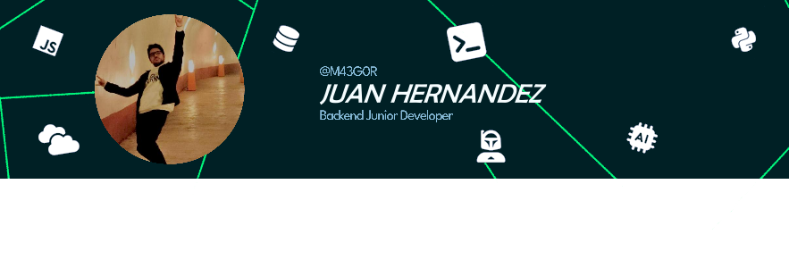

<h1 align="center">
    🚀 Hello there, I´m Juan Hernandez⚡
</h1>

        
<h2 align="center">
      Tech Stack  
</h2>

   
<h2 align="center">
      Tech Stack  
</h2>

- #### I´m a computer engineering student, specialized in BackEnd, AI, and more.
- #### I study at UPIICSA / IPN.
- #### I´m constantly learning algorithms and technologies.

   
<h2 align="center">
      Contact me  
</h2>

<!--Gmail-->

<!--Instagram-->

<!--LinkedIn-->

<!--Discord-->

<!--LeetCode-->

<!--Codewars-->

 

 